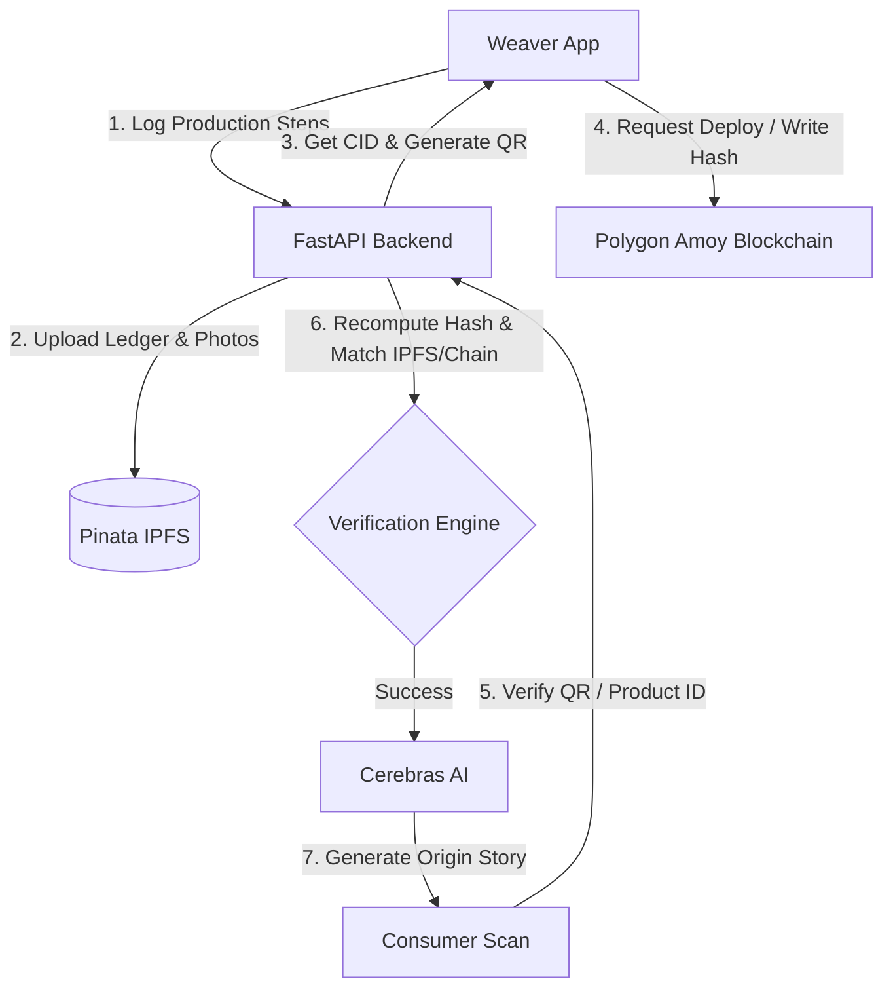

# Tantuve — Threads of Truth

Tantuve (meaning "thread" in Sanskrit) is an IPFS-anchored, blockchain-secured traceability platform designed to verify the authenticity and Geographical Indication (GI) status of traditional Indian handloom textiles. 

By cryptographically chaining the ledger of the production cycle (from yarn sourcing to final finishing) and anchoring it immutably on the Polygon Amoy blockchain and IPFS, Tantuve prevents counterfeiting, protects weavers' livelihoods, and provides consumers with transparent proof of authenticity accompanied by AI-generated textile origin stories.

---

## Table of Contents
- [Project Overview](#project-overview)
- [System Architecture](#system-architecture)
- [Key Features](#key-features)
- [Tech Stack](#tech-stack)
- [Directory Structure](#directory-structure)
- [Setup Instructions](#setup-instructions)
  - [Prerequisites](#prerequisites)
  - [Backend Setup (FastAPI)](#backend-setup-fastapi)
  - [Blockchain Setup (Hardhat)](#blockchain-setup-hardhat)
  - [Frontend Setup (Next.js)](#frontend-setup-nextjs)
- [Usage Examples](#usage-examples)
  - [Weaver Workflow](#weaver-workflow)
  - [Verification Workflow](#verification-workflow)
  - [GI Authority (Admin) Workflow](#gi-authority-admin-workflow)
- [Security & Validation Policies](#security--validation-policies)

---

## Project Overview

Traditional Indian handloom crafts (like Banarasi Silk, Kanjeevaram Silk, and Pochampally Ikat) are frequently counterfeited by powerloom imitations. To combat this, the Indian government uses Geographical Indication (GI) tags. Tantuve digitalizes and enforces GI authenticity:
1. **Immutable Log Integrity**: Production stages are chained using a SHA-256 hash link sequence.
2. **IPFS Storage**: The final product log is anchored to IPFS (via Pinata) for decentralized persistence.
3. **Polygon Verification**: An immutable signature/hash of the ledger is written to the `TantuveRegistry` Solidity contract on the Polygon Amoy testnet.
4. **AI-Driven Storytelling**: Cerebras AI uses Llama 3 to convert production step logs into engaging, culturally rich "origin stories" for consumers scanning the QR code.

---

## System Architecture



---

## Key Features

- **Cryptographic Hash Chaining**: Every ledger entry (Yarn Sourcing, Dyeing, Weaving, Finishing) references the hash of the preceding entry, making the history tamper-evident.
- **Plausibility Detection**: Checks the duration between production steps. Quick entries trigger a time-based flagging system to prevent mock/spam logging.
- **Decentralized Anchoring**: Finished ledgers are saved to IPFS, and their final state hash is registered on-chain via the `TantuveRegistry` smart contract.
- **Dynamic QR Code Generation**: Completed products generate a secure QR code linking consumers directly to the verification page.
- **AI-Powered Origin Stories**: Scans fetch step logs, verify data integrity, and invoke Cerebras AI to create an expressive narration of the textile's history.
- **Whitelist Management**: GI Authorities (Admins) review and approve weaver profiles, handle disputes, resolve counterfeit claims, and conduct randomized spot-checks.

---

## Tech Stack

- **Smart Contracts**: Solidity, Hardhat, Ethers.js
- **Backend API**: Python, FastAPI, Supabase Python client, Pydantic, HTTPX, PyJWT
- **Database**: Supabase (PostgreSQL)
- **Frontend App**: Next.js 15, React 19, Tailwind CSS v4, Lucide Icons, GSAP, HTML5 QR Scanner, Recharts, jsPDF

---

## Directory Structure

```text
tantuve-threads-of-truth/
├── backend/                  # FastAPI Application
│   ├── app/
│   │   ├── core/             # Configuration & Auth helpers
│   │   ├── routers/          # API endpoint groups (admin, weaver, verify, auth)
│   │   ├── schemas/          # Pydantic validation models
│   │   ├── services/         # IPFS, Database, Blockchain, and Cerebras AI integrations
│   │   └── main.py           # FastAPI entrypoint
│   └── requirements.txt      # Python dependencies
│
├── blockchain/               # Hardhat Project
│   ├── contracts/            # Smart contracts (TantuveRegistry.sol)
│   ├── scripts/              # Deploy & interaction scripts
│   ├── package.json          # Blockchain scripts & devDependencies
│   └── hardhat.config.js     # Hardhat settings
│
├── src/                      # Next.js Frontend
│   ├── app/                  # App router pages (admin, weaver, verify, login, scan)
│   ├── components/           # Reusable UI widgets
│   └── lib/                  # Shared utilities (Supabase, contract ABI helper)
│
└── package.json              # Frontend scripts & dependencies
```

---

## Setup Instructions

### Prerequisites
- Node.js (v18+)
- Python (v3.10+)
- A Supabase account and project
- A Pinata (IPFS) developer account
- A Cerebras AI API key
- Polygon Amoy testnet RPC connection (via Alchemy or similar)

### Environment Configuration
Create a `.env.local` file in the project root containing:
```env
CEREBRAS_API_KEY="your_cerebras_api_key"
SUPABASE_URL="https://your-project.supabase.co"
SUPABASE_PUBLISHABLE_KEY="your_supabase_anon_key"
SUPABASE_SERVICE_ROLE_KEY="your_supabase_service_role_key"
ALCHEMY_API_KEY="your_alchemy_api_key"
PINATA_JWT="your_pinata_jwt_token"
PINATA_API_KEY="your_pinata_api_key"
PINATA_SECRET_API_KEY="your_pinata_secret_key"
JWT_SECRET="your_custom_jwt_secret"
PRIVATE_KEY="your_wallet_private_key"
FRONTEND_URL="http://localhost:3000"
```

### Backend Setup (FastAPI)
1. Navigate to the backend directory:
   ```bash
   cd backend
   ```
2. Create and activate a virtual environment:
   ```bash
   python -m venv venv
   # On Windows:
   venv\Scripts\activate
   # On macOS/Linux:
   source venv/bin/activate
   ```
3. Install dependencies:
   ```bash
   pip install -r requirements.txt
   ```
4. Launch the FastAPI server:
   ```bash
   uvicorn app.main:app --reload --port 8000
   ```

### Blockchain Setup (Hardhat)
1. Navigate to the blockchain directory:
   ```bash
   cd blockchain
   ```
2. Install npm packages:
   ```bash
   npm install
   ```
3. Compile the Solidity smart contracts:
   ```bash
   npx hardhat compile
   ```
4. Deploy to the Polygon Amoy testnet:
   ```bash
   node scripts/deploy.js
   ```
   *Note: This script will deploy the contract and write the deployment address/ABI artifact to `src/lib/contract.json` for the frontend.*

### Frontend Setup (Next.js)
1. From the project root, install packages:
   ```bash
   npm install
   ```
2. Run the Next.js development server:
   ```bash
   npm run dev
   ```
3. Open [http://localhost:3000](http://localhost:3000) in your web browser.

---

## Usage Examples

### Weaver Workflow
1. **Register/Login**: A weaver registers and requests profile activation by the GI Authority.
2. **Draft Product**: The weaver inputs the title and craft type (e.g. *Pochampally Ikat*).
3. **Log Progress**: The weaver appends production logs as they work:
   - **Post step details**:
     ```json
     POST /weaver/products/TNT-PTL-00231/steps
     Authorization: Bearer <token>
     {
       "step_name": "dyeing",
       "step_data": {
         "color_source": "Natural Madder Root",
         "duration_days": 3
       },
       "photo_base64": "data:image/jpeg;base64,..."
     }
     ```
4. **Complete Product**: Upon selecting **Complete**, the backend verifies the ledger sequence, uploads the manifest metadata to IPFS, and registers the ledger state on the blockchain:
   ```json
   POST /weaver/products/TNT-PTL-00231/complete
   ```

### Verification Workflow
1. Consumers scan the QR code on a textile product.
2. The UI queries the verification endpoint:
   ```json
   GET /verify/TNT-PTL-00231
   ```
3. The backend executes verification:
   - Re-hashes steps sequentially using `sha256` to ensure no logs were modified.
   - Compares the final re-hashed code with the IPFS CID's pinned data.
   - Confirms the weaver's GI registered status in the database.
   - Fetches the Polygon Amoy contract registry record to match the ledger hash.
4. Returns verification validity along with the generated AI origin story:
   ```json
   {
     "verified": true,
     "chainValid": true,
     "ipfsVerified": true,
     "originStory": "Deep in the weavers' village of Pochampally, artisan Sridhar gathered natural madder roots to dye the fine cotton yarn..."
   }
   ```

### GI Authority (Admin) Workflow
- **Review Weavers**: Approve or reject applicant credentials. Approving a weaver sets `gi_registered = true`, enabling them to produce authenticated textiles.
- **Dispute Resolution**: Review reports submitted by consumers flagged as suspect or counterfeit. If verified counterfeit, mark the product as `flagged` to invalidate future scans.
- **Audit Spot Checks**: Review the ~12% randomly sampled completed products or plausibility-flagged records (e.g., if multiple steps were uploaded within minutes instead of hours).

---

## Security & Validation Policies

1. **Immutable Ledger**: The `TantuveRegistry.sol` contract enforces that once a product code is registered, it can never be rewritten or modified (`require(!records[productId].exists, "Already registered")`).
2. **Link Verification**: Each ledger entry's hash is computed as:
   $$\text{Hash} = \text{SHA-256}(\text{productId} \mid \text{seq} \mid \text{stepName} \mid \text{stepData} \mid \text{timestamp} \mid \text{previousEntryHash})$$
3. **Anti-Spam Time Gates**: The backend checks elapsed seconds between sequential steps. If the time difference is less than 2 hours, it flags the record for manual admin audit.
